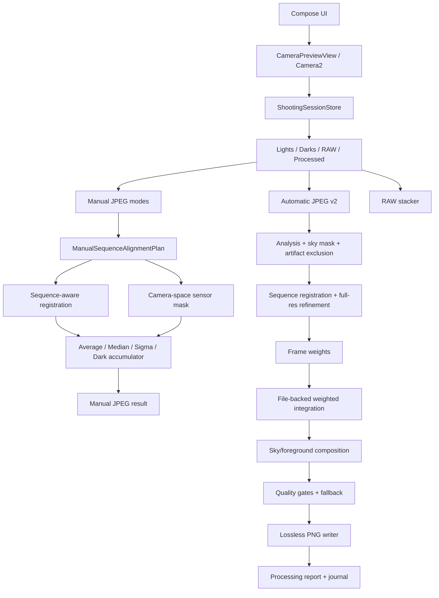

# Технический аудит AstroPhoto

Аудит выполнен 30 июля 2026 года. Production-код, тесты и fixture не изменялись. APK не устанавливался, данные приложения не очищались. Телефон использовался только для чтения MediaStore, processing report и проверки сохранности сессий.

Обозначения:

- **Код/тест** — подтверждено реализацией и автоматическим тестом.
- **Real device** — подтверждено на Xiaomi 23021RAA2Y.
- **Предположение** — технически обосновано, но не доказано эталоном.
- **Неизвестно** — имеющихся данных недостаточно.

## 1. Краткое резюме

Текущая обработка заметно сильнее обычного простого stacking:

- automatic JPEG v2 имеет sequence-aware регистрацию, full-resolution refinement, весовую интеграцию, sky/foreground composition, quality gates, безопасный fallback и lossless PNG;
- manual aligned режимы теперь сохраняют исходные индексы, полностью исключают rejected frames и фильтруют подтверждённые camera-space дефекты на уровне отдельных samples;
- MIUI-проблема `MediaStore.SIZE=0` исправлена: валидность определяется записанными байтами и структурой PNG;
- полный unit-suite проходит: **920/920**;
- текущие сессии и исходники на телефоне сохранились.

Главное ограничение: нельзя утверждать, что видны или удержаны все звёзды. Fixture содержит только:

- 2 ранее вручную размеченные звезды;
- 1 автоматически предложенную provisional-звезду;
- всего 3 размеченных `star`, что недостаточно для полного astronomical recall.

Допустимые подтверждённые утверждения:

- для fixture: **все три текущих provisional reference stars прошли regression-проверку**;
- для последнего automatic real-device отчёта: **удержаны все 44 опорные звезды, использованные текущей регистрацией**.

Инженерно это уже пригодная beta для реальных сессий при сохранении исходников. Научно полную сохранность слабых звёзд считать доказанной нельзя.

## 2. Состояние репозитория

| Параметр | Текущее значение |
|---|---|
| Ветка | `main` |
| Синхронизация | `main...origin/main`, расхождений нет |
| HEAD | `fa5aa24 Fix manual stacking and add tap focus regressions` |
| Предыдущий commit | `9d45315 Harden Enhanced result generation and storage` |
| Рабочее дерево | чистое |
| Application ID | `com.example.astrophoto` |
| Версия | `0.9.0-beta.1`, versionCode 2 |
| SDK | min 26, target 36 |
| Production Kotlin | 173 файла |
| JPEG v2 production | 107 файлов |
| Unit-test Kotlin/helpers | 80 файлов |
| Изменения во время аудита | отсутствуют |

Конфигурация приложения: [app/build.gradle.kts](../app/build.gradle.kts#L15).

Последний commit очень крупный: 64 файла, 7261 добавление. Он объединяет:

- rejected-frame fix;
- sample-level sensor-defect filtering;
- fixture и diagnostics;
- MIUI PNG fix;
- tap-to-focus.

Это ухудшает трассируемость изменений: camera focus не относится к обработке снимков, хотя находится в том же commit.

## 3. Архитектура

| Слой | Основные компоненты | Ответственность |
|---|---|---|
| Compose/UI | `MainActivity`, `JpegStackingBlock` | съёмка, выбор сессии, режимов и запуск обработки |
| Camera2 | `CameraPreviewView`, `CameraTapFocus` | preview, JPEG/DNG capture, ручные параметры, tap focus |
| Сессии | `ShootingSessionStore`, `SessionFramesRepository` | структура `Lights/JPEG`, `Lights/RAW`, `Darks`, `Processed` |
| Manual JPEG | `JpegStacker`, `AverageStacking`, `MedianStacking`, `SigmaStacking` | Average/Median/Sigma/Dark, alignment, JPEG output |
| Manual sequence | `ManualSequenceAlignment` | sequence registration, accepted/rejected plan, исходные индексы |
| Sensor filtering | `SensorDefectMask`, `ManualSensorDefectFiltering` | camera-space mask и per-sample exclusion |
| Automatic JPEG v2 | `processing/jpeg/v2/**` | анализ, регистрация, интеграция, mask/composition, quality gates |
| RAW | `RawStacker`, `AstroRawFormat`, `LinearRawProcessing` | sidecar RAW16, проявка, простое выравнивание и stacking |
| PNG/output | `LosslessProcessedImageWriter` | streaming PNG, validation, MediaStore publication |
| Диагностика | `ProcessingReport`, journal/store | JSON report, recovery, timing и quality metrics |
| Regression | `urban-window-30`, Stage 6 tests | реальная 30-кадровая серия и provisional ground truth |

Слабая архитектурная точка — [JpegStacker.kt](../app/src/main/java/com/example/astrophoto/JpegStacker.kt#L275): 6687 строк, в одном классе соединены orchestration, UI callbacks, manual modes, automatic pipeline, storage и reporting. Пока переписывать его не нужно, но дальнейшие функции лучше добавлять в существующие специализированные JPEG v2 компоненты.

## 4. Полный automatic JPEG v2 path

Готовые профили реально подключены к UI и вызывают `profileStack`, а не старый legacy recipe: [JpegStacker.kt](../app/src/main/java/com/example/astrophoto/JpegStacker.kt#L5861), [JpegStacker.kt](../app/src/main/java/com/example/astrophoto/JpegStacker.kt#L6091).

Доступны:

- `DEEP_SKY`, минимум 4;
- `DEEP_SKY_ALIGNED`, минимум 4;
- `URBAN_SKY`, минимум 4;
- `URBAN_SKY_STRONG`, минимум 6;
- `MAX_STARS`, минимум 6.

Источник: [AstroProcessingProfile.kt](../app/src/main/java/com/example/astrophoto/AstroProcessingProfile.kt#L15).

Путь обработки:

1. Проверяются профиль, число кадров и категория `Lights/JPEG`.
2. Серия ограничивается 30 кадрами.
3. Определяется общее разрешение и analysis scale до максимальной стороны 960.
4. Каждый кадр декодируется в analysis-разрешении.
5. `SkyMaskEstimator` строит предварительную sky mask.
6. `JpegFrameAnalyzer` измеряет звёзды, фон, резкость, шум и trail evidence.
7. `StaticArtifactAnalyzer` классифицирует camera-stable точки и исключает их из звёздной регистрации.
8. Выбирается reference frame.
9. `CaptureSequenceIndexResolver` сохраняет реальные capture indices.
10. `SequenceAwareRegistrationEngine` строит temporal tracks, motion model и локальные трансформации.
11. `TransformSequenceValidator` проверяет непрерывность последовательности.
12. Ненадёжные кадры удаляются из accepted collection.
13. Трансформации масштабируются до полного разрешения.
14. Full-resolution patch и stellar-centroid refinement могут дополнительно отклонить кадры.
15. `FrameWeightCalculator` рассчитывает веса по регистрации, sharpness, trails, noise и exposure.
16. `LinearWeightedIntegrator` выполняет file-backed full-resolution stacking.
17. Интегрируется только исходная sky mask; valid coverage сохраняется отдельной float-plane.
18. Sky mask уточняется, а подтверждённые звёзды защищаются от потери.
19. `FileBackedSkyForegroundComposer` объединяет stacked sky с foreground reference.
20. Quality gates проверяют звёзды, фон, foreground, coverage и line artifacts.
21. Adaptive Stage 4 запускается только если clean stack уже прошёл gate.
22. `ResultSelectionPolicy` выбирает processed result либо clean fallback.
23. Основной результат сохраняется в PNG.
24. Опционально создаётся `Enhanced`.
25. Записываются processing report, journal и session metadata.

Основные участки: [JpegStacker.kt](../app/src/main/java/com/example/astrophoto/JpegStacker.kt#L1224), [регистрация](../app/src/main/java/com/example/astrophoto/JpegStacker.kt#L1441), [full-resolution refinement](../app/src/main/java/com/example/astrophoto/JpegStacker.kt#L1570), [веса](../app/src/main/java/com/example/astrophoto/JpegStacker.kt#L1632), [интеграция](../app/src/main/java/com/example/astrophoto/JpegStacker.kt#L1694), [mask](../app/src/main/java/com/example/astrophoto/JpegStacker.kt#L1789), [Stage 4](../app/src/main/java/com/example/astrophoto/JpegStacker.kt#L1935), [selection](../app/src/main/java/com/example/astrophoto/JpegStacker.kt#L2006).

Профили используют разные ограниченные параметры gradient removal, neutralization, asinh, chroma reduction и star contrast: [ExistingPresetParameterMapper.kt](../app/src/main/java/com/example/astrophoto/processing/jpeg/v2/profile/ExistingPresetParameterMapper.kt#L44).

Сильная сторона — обработка не обязана публиковать агрессивный результат. Последний real-device `URBAN_SKY_STRONG` был отклонён по `sky_mad_increased_excessively`, после чего сохранился `CLEAN_STACK` как `RecoveredStars`. Это правильное безопасное поведение.

## 5. Manual aligned режимы

| Режим | Реализация | Поведение после исправлений |
|---|---|---|
| Average aligned | `stack()` | rejected frames пропускаются до full decode; per-pixel weight при sensor mask |
| Median aligned | `medianStack()` | compact collection содержит только accepted frames; masked samples не добавляются |
| Sigma aligned | `sigmaStack()` | sigma считается только по valid samples |
| Dark-subtracted aligned Average | `stackWithDarkFrames()` | light frame сначала калибруется master dark, затем masked sample исключается |

Average: [JpegStacker.kt](../app/src/main/java/com/example/astrophoto/JpegStacker.kt#L330).

Median: [JpegStacker.kt](../app/src/main/java/com/example/astrophoto/JpegStacker.kt#L792).

Sigma: [JpegStacker.kt](../app/src/main/java/com/example/astrophoto/JpegStacker.kt#L1036).

Dark-aligned: [JpegStacker.kt](../app/src/main/java/com/example/astrophoto/JpegStacker.kt#L4159).

Общие свойства:

- sequence-aware path включается только при 8 и более кадрах;
- для меньших серий применяется legacy alignment;
- accepted list может быть compacted только внутри accumulator;
- transformation всегда берётся по original index;
- manual shift остаётся целочисленным;
- manual output сохраняется в JPEG, в отличие от automatic lossless PNG;
- все четыре aligned режима используют один `ManualSequenceAlignmentPlan`.

Нюанс: переключатель `SAFE` влияет на legacy `alignManualImages`, но не передаётся в sequence-aware planner. Для 30-кадровой серии надпись `Average + SAFE` не означает отдельные sequence thresholds: используются общие acceptance gates.

## 6. Регистрация

### Sequence-aware модель

Engine:

- сортирует кадры по `captureIndex`;
- строит temporal tracks;
- оценивает ненулевое движение неба;
- предсказывает transform для конкретного исходного capture index;
- выполняет model-guided local registration;
- сравнивает local, legacy и predicted transform;
- сохраняет per-frame confidence, residual, path и rejection reason.

Источник: [SequenceAwareRegistrationEngine.kt](../app/src/main/java/com/example/astrophoto/processing/jpeg/v2/registration/SequenceAwareRegistrationEngine.kt#L17).

Reference frame принудительно получает identity transform и считается accepted: [SequenceAwareRegistrationEngine.kt](../app/src/main/java/com/example/astrophoto/processing/jpeg/v2/registration/SequenceAwareRegistrationEngine.kt#L297).

### Динамический shift limit

Старый предел ±30 px был недостаточен. Сейчас предел:

- начинается с 30 px;
- линейно растёт по позиции кадра;
- конечный предел — 5% максимальной стороны;
- ограничивается максимумом 96 px.

Источник: [ManualStarAlignment.kt](../app/src/main/java/com/example/astrophoto/ManualStarAlignment.kt#L14).

Для 1440×1920 frame 30 имеет разрешённый component-wise предел 96 px.

Последний real-device automatic report:

- frame 30: `dx=-53.473095`, `dy=55.394424`;
- максимальный компонент: **55.394 px**;
- евклидова длина: **76.993 px**.

Предыдущий manual report давал примерно `dx=-55`, `dy=57`. В обоих случаях ±30 был бы недостаточен.

Fixture работает в 720×960 и показывает predicted displacement `-29.828934, +34.498306`; при масштабировании на полный размер это примерно `-59.66, +69.00`. Источник: [candidate-review.md](../app/src/test/resources/jpeg-stage6/urban-window-30/diagnostics/candidate-review.md#L5).

### Почему accepted count различается

| Путь | Accepted |
|---|---:|
| Fixture manual plan 720×960 | 22/30 |
| Real-device manual plan, исходное поле 1440×1920 | 28/30 |
| Последний automatic provisional stage | 28/30 |
| Последний automatic после full-resolution refinement | 20/30 |

Причины:

- fixture — crop исходной серии с другим полем и количеством доступных звёзд;
- manual fixture diagnostics выполняются на fixture-разрешении;
- real manual анализирует downsample полного кадра;
- automatic pipeline дополнительно применяет full-resolution centroid gate;
- threshold не меняется, меняется наблюдаемая evidence.

Последний automatic report отклонил итоговые кадры 18, 19, 23–30. Кадры 23 и 24 были отклонены ещё на provisional stage; остальные — full-resolution refinement.

## 7. Фильтрация rejected frames

`ManualSequenceAlignmentPlan` хранит для каждого исходного кадра:

- `originalFrameIndex`;
- `frameId`;
- `accepted`;
- `rejectionReason`;
- shift;
- residual;
- confidence.

Источник: [ManualSequenceAlignment.kt](../app/src/main/java/com/example/astrophoto/ManualSequenceAlignment.kt#L18).

`manualSequenceFrameWork` фильтрует rejected, индексирует входной список через original index, отдельно выдаёт compact frame number, проверяет minimum frame count и не возвращает rejected кадры при нехватке accepted: [ManualSequenceAlignment.kt](../app/src/main/java/com/example/astrophoto/ManualSequenceAlignment.kt#L125).

Дополнительная защита запрещает transform lookup для rejected frame: [JpegStacker.kt](../app/src/main/java/com/example/astrophoto/JpegStacker.kt#L3462).

### Fixture

- Accepted: **1–21, 25**
- Rejected: **22, 23, 24, 26, 27, 28, 29, 30**
- Integrated: **1–21, 25**
- Reference: frame 9, включён
- Вес каждого rejected: `0.0`

Тест: [ManualSequenceRejectedFrameFilterTest.kt](../app/src/test/java/com/example/astrophoto/ManualSequenceRejectedFrameFilterTest.kt#L13).

### Real-device manual

- Input: 30
- Accepted: 28
- Rejected: 23, 24
- Integrated: 1–22, 25–30
- Причина обоих: `Insufficient robust local inliers`
- Reference включён
- Rejected не декодируются и не поступают в accumulator

Предыдущий rejected-frame-only прогон снизил целевой trail contrast приблизительно на 39%.

Report включает input/accepted/rejected counts, original rejected indices, reasons и фактические integrated indices: [JpegStacker.kt](../app/src/main/java/com/example/astrophoto/JpegStacker.kt#L4878).

### Ограничение

Любая `ManualSequenceInsufficientFramesException` остаётся hard failure. Однако другие исключения при построении sequence plan перехватываются и переводят режим в legacy fallback: [JpegStacker.kt](../app/src/main/java/com/example/astrophoto/JpegStacker.kt#L3422). В таком fallback нет sequence rejected decisions и sensor mask.

## 8. Sensor-defect filtering

### Формирование mask

`PersistentSensorCandidateDetector` только предлагает кандидатов; он не является окончательным астрономическим классификатором: [PersistentSensorCandidateDetector.kt](../app/src/main/java/com/example/astrophoto/processing/jpeg/v2/artifacts/PersistentSensorCandidateDetector.kt#L8).

Production mask допускает только:

- `HOT_PIXEL`;
- `SINGLE_CHANNEL_SPIKE`;
- `FIXED_PATTERN_POINT`;
- confidence ≥ 0.95;
- camera recurrence ≥ 0.90;
- camera support / sky support ≥ 2.5;
- footprint ≤ 64 pixels;
- суммарную masked fraction ≤ 0.001, то есть 0.1%.

Источник: [SensorDefectMask.kt](../app/src/main/java/com/example/astrophoto/processing/jpeg/v2/artifacts/SensorDefectMask.kt#L32), [buildConfirmedSensorDefectMask](../app/src/main/java/com/example/astrophoto/processing/jpeg/v2/artifacts/SensorDefectMask.kt#L141).

`uncertain`, coherent sky tracks, reflections и слишком большие footprints не включаются.

### Координаты и sample exclusion

Mask остаётся в координатах камеры. Для output pixel применяется original alignment shift, после чего проверяется соответствующая source coordinate: [ManualSensorDefectFiltering.kt](../app/src/main/java/com/example/astrophoto/ManualSensorDefectFiltering.kt#L32).

Masked sample:

- получает нулевой вес;
- не заменяется чёрным;
- не входит в Average normalization;
- не входит в Median/Sigma collection;
- не влияет на dark-subtracted average;
- заменяется reference sample только если valid coverage действительно недостаточен.

Coverage gate отключает mask, если доля output pixels с недостаточным покрытием превышает 0.1%: [ManualSensorDefectFiltering.kt](../app/src/main/java/com/example/astrophoto/ManualSensorDefectFiltering.kt#L110).

### Fixture-результат

| Метрика | Значение |
|---|---:|
| Mask regions | 10 |
| Mask pixels | 210 |
| Mask fraction | 0.030381946% |
| Safety limit | 0.1% |
| Excluded samples | 4599 |
| Affected output pixels | 2533 |
| Remaining samples min/median/max | 18 / 22 / 22 |
| Insufficient coverage pixels | 0 |

Trail contrast:

- `defect-01`: `0.479273 → 0.075364`, снижение 84.27%;
- `defect-02`: `0.100000 → -0.392591`; положительный trail устранён, но отрицательное значение нельзя трактовать как обычный процент улучшения.

Annotated source contrast:

- `star-01`: `42.071 → 42.071`;
- `star-02`: `12.587 → 12.587`;
- generated provisional `candidate-x55810-y22220`: `5.0 → 5.0`.

Свежий тестовый вывод: [ManualSensorDefectFilteringTest.xml](../app/build/test-results/testDebugUnitTest/TEST-com.example.astrophoto.ManualSensorDefectFilteringTest.xml).

### Real-device sample-mask run

Зафиксированный report:

- 8 regions;
- 552 masked source pixels;
- 0.019965% source frame;
- 15 158 excluded samples;
- 8078 affected output pixels;
- 0 insufficient-coverage pixels;
- accepted/rejected остались 28/2.

Числа min/median/max remaining samples для этого real-device запуска в доступном сейчас app-specific JSON отсутствуют, поэтому они не заявляются.

### Главный незакрытый пробел

Новый `SensorDefectMask` подключён только к manual aligned modes. Automatic JPEG v2 использует static artifacts при регистрации и quality analysis, но `LinearWeightedIntegrator` не получает camera-space sensor mask: [JpegStacker.kt](../app/src/main/java/com/example/astrophoto/JpegStacker.kt#L1694).

Следовательно, для automatic profiles полное отсутствие camera-defect trails пока не гарантируется.

## 9. PNG и MediaStore

### Причина старой ошибки

Точно доказать внутреннюю причину поведения MIUI нельзя. Наблюдаемое поведение: pending MediaStore entry мог возвращать `SIZE=0`, хотя поток уже содержал корректный PNG. Ошибка приложения состояла в использовании этого metadata field как обязательного подтверждения валидности.

### Текущий порядок

1. `CountingOutputStream` считает фактически переданные байты.
2. Требуется `encodedBytes > 0`.
3. Pending URI открывается для чтения.
4. Проверяются signature, IHDR, dimensions, chunk order, CRC, zlib data, ожидаемое число inflated bytes и IEND.
5. Запись публикуется через `IS_PENDING=0`.
6. После публикации `SIZE` запрашивается только как необязательная диагностика.
7. `SIZE=null/0` не отменяет уже валидированный результат.

Источник: [LosslessProcessedImageWriter.kt](../app/src/main/java/com/example/astrophoto/processing/jpeg/v2/output/LosslessProcessedImageWriter.kt#L150), [PngStructureValidator](../app/src/main/java/com/example/astrophoto/processing/jpeg/v2/output/LosslessProcessedImageWriter.kt#L191), [MediaStore publication](../app/src/main/java/com/example/astrophoto/processing/jpeg/v2/output/LosslessProcessedImageWriter.kt#L430).

MIUI regression: [EnhancedPngStorageHardeningTest.kt](../app/src/test/java/com/example/astrophoto/processing/jpeg/v2/output/EnhancedPngStorageHardeningTest.kt#L163).

На Android ниже Q используется temporary file, `fsync`, validation и move без overwrite: [LosslessProcessedImageWriter.kt](../app/src/main/java/com/example/astrophoto/processing/jpeg/v2/output/LosslessProcessedImageWriter.kt#L337).

### Последний проверенный PNG

- файл: `RecoveredStars_20260729_121950.png`;
- размер: **1 410 562 байта**;
- разрешение: **1440×1920**;
- PNG signature: `89504E470D0A1A0A`;
- 77 chunks: `IHDR`, 75×`IDAT`, `IEND`;
- декодируется как `Format32bppArgb`;
- SHA-256: `F657321C277E1443D1B4CED5082D13512D6A5D75B198976797695E188C1508B6`.

Его processing report:

- preset `URBAN_SKY_STRONG`;
- input 30;
- provisional accepted 28;
- final accepted 20;
- processed candidate отклонён по `sky_mad_increased_excessively`;
- выбран `CLEAN_STACK`;
- fallback `RecoveredStars`;
- reference stars 44/44;
- report сохранён в app-specific fallback.

### Enhanced

Основной PNG записывается раньше, чем начинается optional Enhanced. Ошибки Enhanced возвращаются как `FAILED/REJECTED` и добавляются в report, не отменяя основной результат: [JpegStacker.kt](../app/src/main/java/com/example/astrophoto/JpegStacker.kt#L2696), [publishAncillaryEnhanced](../app/src/main/java/com/example/astrophoto/JpegStacker.kt#L2783).

В commit `fa5aa24` writer менялся именно для MIUI publication coordinator. Encoder и структура validator относительно `9d45315` не переписывались.

## 10. Fixture и provisional ground truth

Fixture: [urban-window-30](../app/src/test/resources/jpeg-stage6/urban-window-30/manifest.properties).

| Свойство | Значение |
|---|---|
| Frames | 30 |
| Размер | 720×960 |
| Reference | `frame-008.jpg`, индекс 9 для пользователя |
| Общий размер JPEG | 885 829 байт |
| Ground truth rows | 24 |
| `star` | 3 |
| `sensor_defect` | 2 |
| `uncertain` | 19 |

Разметка: [ground-truth.csv](../app/src/test/resources/jpeg-stage6/urban-window-30/ground-truth.csv).

Важно различать происхождение:

- ранее вручную сохранённые строки: `star-01`, `star-02`, `defect-01`, `defect-02`, `uncertain-01`, `uncertain-02`;
- ещё 18 строк имеют ID `candidate-*` и созданы детерминированной диагностикой;
- среди автоматически предложенных кандидатов один получил provisional class `star`, остальные — `uncertain`;
- эти auto-классы нельзя представлять как ручную разметку.

`uncertain` исключается из scored ground truth: [Stage6RegressionFixture.kt](../app/src/test/java/com/example/astrophoto/Stage6RegressionFixture.kt#L40).

Candidate generator сохраняет существующие классификации, стабильно сортирует ID и генерирует JSON/Markdown/contact sheets. Тест: [Stage6CandidateDiagnosticsTest.kt](../app/src/test/java/com/example/astrophoto/Stage6CandidateDiagnosticsTest.kt#L14).

Хэши:

| Артефакт | SHA-256 |
|---|---|
| `manifest.properties` | `A4B5E8457041ECC9E2100D3D680DE22A6CA5790DF31E49D15D81812C298EA43A` |
| `ground-truth.csv` | `D38485A51EB9E281C171C7DDEAB0C81AB487CF9E2ED1C74A97473743A2E9B9B1` |
| список SHA-256 всех 30 frames | `5d003108b5b499d2239ac466ba4cdf0d828da04d66b260aa710fb6a88ea6315d` |
| `candidate-diagnostics.json` | `FBE5BB8A4C776FB96F49D2E700E23BA600E538128EBACA0E11C378976D2E57B1` |
| `candidate-review.md` | `5D2C08F8E618B38859172A86551354EAA04F8AB29936A525BDD55A94118B7AFC` |

Fixture позволяет проверять известные источники, но не полный astronomical recall: нет полного ручного каталога всех видимых точек и нет внешнего астрономического каталога.

## 11. Сводные результаты

| Проверка | Результат | Уровень |
|---|---|---|
| Focused regressions | 60/60 | Код/тест |
| Полный unit-suite | 920/920, 70 suites | Код/тест |
| `assembleDebug` | успешно | Build |
| `git diff --check` | успешно | Git |
| Fixture manual accepted | 22/30 | Код/fixture |
| Fixture rejected | 22, 23, 24, 26–30 | Код/fixture |
| Fixture defect mask | 10 regions, 210 pixels | Код/fixture |
| Fixture excluded samples | 4599 | Код/fixture |
| Fixture insufficient coverage | 0 | Код/fixture |
| Real manual accepted | 28/30 | Real device |
| Real manual rejected | 23, 24 | Real device |
| Real manual sensor mask | 8 regions, 552 pixels | Real device |
| Real manual excluded samples | 15 158 | Real device |
| Real manual insufficient coverage | 0 | Real device |
| Последний automatic provisional | 28/30 | Real-device report |
| Последний automatic final | 20/30 | Real-device report |
| Automatic reference stars | 44/44 retained | Real-device report |
| Последний PNG | 1 410 562 bytes, 1440×1920 | Real device |
| Сессии на телефоне | 24 | Read-only device audit |
| Исходники выбранной сессии | 30 Lights/JPEG | Read-only device audit |

### Real-device trail comparison

Сравнивались одинаковые 1364×1841 результаты:

- до sample mask: `StackedAligned_20260728_204303.jpg`, 297 867 байт;
- после sample mask: `StackedAligned_20260728_224613.jpg`, 297 803 байта.

SHA-256:

- before: `5F7F96B523CB1BFC90B1CBE1ACD54106E940DC490CB3399710F6B8359AB25192`;
- after: `7B7A2DA6FBA88787CDA749BFDD6459E264AC47A7262E1A04D9B3F4C58D349B20`.

| Метрика | До | После | Изменение |
|---|---:|---:|---:|
| Positive local-contrast sum | 1179.150 | 864.943 | −26.65% |
| Absolute residual | 2056.627 | 1839.706 | −10.55% |
| RMS residual | 0.74960 | 0.66704 | −11.01% |

Вывод: trails стали слабее, но не доказано, что исчезли все. Оставшиеся следы могут происходить от неразмеченных дефектов, JPEG residuals или mask boundaries.

## 12. Что гарантируется

| Гарантия | Доказательство |
|---|---|
| Pending `SIZE=0` не блокирует валидный PNG | `miuiPendingSizeZeroDoesNotBlockValidatedPublication` |
| Нулевой фактический output запрещён | `zeroActuallyWrittenBytesAreRejectedBeforePublication` |
| Некорректный PNG не публикуется | validator tests |
| Rejected manual frames не доходят до Average/Median/Sigma/Dark accumulators | frameWork перед decode + regression tests |
| Original indices не заменяются compact indices | `transformLookupNeverUsesCompactedIndex` |
| Reference frame остаётся включён | plan invariant и test |
| При нехватке accepted rejected frames не возвращаются | `tooFewAcceptedFramesFailWithoutRestoringRejectedFrames` |
| Confirmed sensor samples получают нулевой weight | sensor filtering tests |
| Median/Sigma не получают synthetic black samples | compact valid-sample tests |
| Output holes не создаются молча | reference fallback / mask disable gate |
| `uncertain` не входит в recall/retention | fixture loader и tests |
| Clean-stack registration path не использует manual frameWork | раздельный код |
| RAW stacker не использует новые manual компоненты | раздельный `RawStacker`; RAW tests проходят |
| Основной PNG не зависит от успеха Enhanced | порядок save и optional outcome |
| Текущие исходники и сессии сохранены | 24 directories и 30 Lights/JPEG на устройстве |
| Все 44 registration reference stars последнего automatic run удержаны | current processing report |

Полный HTML-отчёт: [unit-test report](../app/build/reports/tests/testDebugUnitTest/index.html).

## 13. Что пока не гарантируется

- Не гарантируется сохранение всех видимых звёзд.
- Не известен полный astronomical recall.
- Не доказано, что auto-generated provisional `star` классифицирован правильно человеком.
- Не гарантируется отсутствие false-positive sensor defect вне текущей серии.
- Не гарантируется отсутствие дефектных trails в automatic JPEG v2.
- Не гарантируется идеальная sky mask: diagnostic уже содержит возможный boundary artifact.
- Не гарантируется одинаковый accepted count для crop fixture и полного кадра.
- Не доказано отсутствие ошибок на других MIUI/Android устройствах.
- Не запускались instrumented `connectedAndroidTest`: это потребовало бы установки test APK и противоречило ограничениям аудита.
- Не проверялась новая реальная ночная серия после 30 июля.
- RAW path не имеет sequence-aware модели уровня JPEG v2 и остаётся значительно проще.
- Manual integer alignment не обеспечивает ту же subpixel точность, что automatic full-resolution refinement.
- При непредвиденной ошибке manual sequence planning возможен legacy fallback.
- Существующая ground truth слишком мала для выбора оптимальных sky-mask или tone-mapping параметров.

## 14. Известные проблемы

| Проблема | Риск | Доказательство |
|---|---|---|
| Automatic integrator не применяет sensor sample mask | Высокий для diagonal trails | mask подключён только к manual paths |
| Ground truth содержит только 3 provisional stars | Высокий для оценки recall | текущий CSV |
| 18 из 24 GT rows созданы автоматикой | Высокий для научной валидности | ID `candidate-*` и generator |
| Catch-all manual planning fallback может вернуть legacy alignment | Средний/высокий | `JpegStacker.kt:3441` |
| Manual shift целочисленный | Средний для слабых PSF | `AlignmentShift`/nearest sampling |
| Возможен sky-mask boundary artifact | Средний | `candidate-x56925-y74428` |
| Manual и automatic reports хранятся разными путями | Средний для диагностики | session info против JSON report store |
| `JpegStacker` содержит 6687 строк | Средний maintainability | текущий файл |
| Commit `fa5aa24` смешивает processing, fixture, PNG и focus | Средний traceability | git stat |
| Последний Strong профиль ушёл в fallback | Низкий функциональный, положительный safety signal | `sky_mad_increased_excessively` |
| Post-publish URI повторно структурно не открывается | Низкий | после publish только optional `SIZE` query |
| RAW alignment ограничен 32 px и проще JPEG v2 | Средний для RAW-серий | [RawStacker.kt](../app/src/main/java/com/example/astrophoto/RawStacker.kt#L204) |

## 15. Карта рисков

| Вероятность / влияние | Низкое влияние | Среднее | Высокое |
|---|---|---|---|
| Высокая вероятность | различие UI SAFE/sequence semantics | manual/automatic report split | неизвестный полный star recall |
| Средняя | post-publish metadata delay | sky-mask boundary, integer manual shift | automatic camera-defect trails |
| Низкая | PNG filename collision | legacy fallback при internal exception | потеря сессий при текущем processing path |

Sensor-mask coverage не близка к safety limit:

- fixture использует 30.38% допустимого лимита;
- real-device mask — около 19.97% лимита;
- insufficient pixels в обоих подтверждённых случаях: 0.

## 16. Возможные следующие направления

1. **Подключить проверенный camera-space sample mask к automatic JPEG v2 integrator.** Не менять регистрацию, acceptance thresholds, sky mask и tone mapping.
2. Расширить ground truth минимум до нескольких реальных серий и вручную проверить auto-generated candidates.
3. Унифицировать manual и automatic processing reports в экспортируемый JSON, не меняя storage paths результатов.
4. Добавить отдельный instrumented device suite для MediaStore/MIUI, запускаемый только через update-install и без очистки данных.
5. После расширения ground truth отдельно исследовать `candidate-x56925-y74428` и другие sky-mask boundaries.

Сейчас не стоит менять tone mapping, star boost или acceptance thresholds: последняя агрессивная обработка уже была безопасно отклонена quality gate, а данных для доказанного улучшения полного star recall нет.

## 17. Рекомендуемый следующий этап

Рекомендуемый ограниченный этап: **Automatic JPEG v2 camera-defect sample exclusion**.

Цель — передать существующий high-confidence `SensorDefectMask` в `LinearWeightedIntegrator` и исключать masked source samples по той же схеме, которая уже доказана в manual modes.

Обязательные границы:

- acceptance/rejected decisions не менять;
- transform mathematics не менять;
- mask eligibility не ослаблять;
- `uncertain` не включать;
- normalization вести по фактическому valid weight;
- quality gate должен видеть coverage diagnostics;
- при excessive coverage отключать mask;
- PNG/MediaStore/RAW/session code не трогать.

Критерии успеха:

- automatic accepted indices остаются прежними;
- defect-01/02 trails уменьшаются;
- три текущих fixture stars не теряют contrast;
- reference 44-star retention не ухудшается на real report;
- insufficient coverage остаётся нулевым;
- основной PNG и fallback behavior не меняются.

## 18. Приложения

### Production-файлы

| Файл/группа | Назначение |
|---|---|
| [MainActivity.kt](../app/src/main/java/com/example/astrophoto/MainActivity.kt#L1028) | UI и запуск capture |
| [CameraPreviewView.kt](../app/src/main/java/com/example/astrophoto/CameraPreviewView.kt#L516) | JPEG/DNG Camera2 capture |
| [CameraTapFocus.kt](../app/src/main/java/com/example/astrophoto/CameraTapFocus.kt) | tap-to-focus |
| [ShootingSessionStore.kt](../app/src/main/java/com/example/astrophoto/ShootingSessionStore.kt#L94) | session paths и metadata |
| [SessionFrames.kt](../app/src/main/java/com/example/astrophoto/SessionFrames.kt#L134) | загрузка кадров |
| [JpegStacker.kt](../app/src/main/java/com/example/astrophoto/JpegStacker.kt#L275) | manual и automatic orchestration |
| [ManualSequenceAlignment.kt](../app/src/main/java/com/example/astrophoto/ManualSequenceAlignment.kt#L18) | per-frame plan |
| [ManualSensorDefectFiltering.kt](../app/src/main/java/com/example/astrophoto/ManualSensorDefectFiltering.kt#L32) | sample exclusion |
| [ManualStarAlignment.kt](../app/src/main/java/com/example/astrophoto/ManualStarAlignment.kt#L14) | legacy alignment и shift limit |
| [SensorDefectMask.kt](../app/src/main/java/com/example/astrophoto/processing/jpeg/v2/artifacts/SensorDefectMask.kt#L32) | production mask policy |
| [SequenceAwareRegistrationEngine.kt](../app/src/main/java/com/example/astrophoto/processing/jpeg/v2/registration/SequenceAwareRegistrationEngine.kt#L7) | sequence registration |
| [FullResolutionRegistrationRefiner.kt](../app/src/main/java/com/example/astrophoto/processing/jpeg/v2/registration/FullResolutionRegistrationRefiner.kt#L42) | full-res refinement |
| [FrameWeightCalculator.kt](../app/src/main/java/com/example/astrophoto/processing/jpeg/v2/integration/FrameWeightCalculator.kt#L13) | integration weights |
| [LinearWeightedIntegrator.kt](../app/src/main/java/com/example/astrophoto/processing/jpeg/v2/integration/LinearWeightedIntegrator.kt) | automatic tile integration |
| [SkyMaskEstimator.kt](../app/src/main/java/com/example/astrophoto/processing/jpeg/v2/masking/SkyMaskEstimator.kt#L12) | initial sky mask |
| [SkyMaskRefiner.kt](../app/src/main/java/com/example/astrophoto/processing/jpeg/v2/masking/SkyMaskRefiner.kt#L15) | full-resolution refinement |
| [AstroResultQualityGate.kt](../app/src/main/java/com/example/astrophoto/processing/jpeg/v2/quality/AstroResultQualityGate.kt#L10) | result gate |
| [ResultSelectionPolicy.kt](../app/src/main/java/com/example/astrophoto/processing/jpeg/v2/quality/ResultSelectionPolicy.kt#L9) | processed/clean fallback |
| [LosslessProcessedImageWriter.kt](../app/src/main/java/com/example/astrophoto/processing/jpeg/v2/output/LosslessProcessedImageWriter.kt#L389) | PNG/MediaStore |
| [ProcessingReport.kt](../app/src/main/java/com/example/astrophoto/processing/jpeg/v2/diagnostics/ProcessingReport.kt) | report schema |
| [AppSpecificProcessingReportStore.kt](../app/src/main/java/com/example/astrophoto/processing/jpeg/v2/diagnostics/AppSpecificProcessingReportStore.kt#L17) | fallback reports |
| [RawStacker.kt](../app/src/main/java/com/example/astrophoto/RawStacker.kt#L11) | RAW path |

### Основные тесты

| Тест | Данные |
|---|---|
| `ManualSequenceRejectedFrameFilterTest` | real fixture + synthetic plans |
| `ManualSensorDefectFilteringTest` | fixture + synthetic samples |
| `Stage6RealDeviceFixtureTest` | real fixture |
| `Stage6CandidateDiagnosticsTest` | real fixture |
| `EnhancedPngStorageHardeningTest` | synthetic streams/MediaStore coordinator |
| `JpegV2Stage10Test` | synthetic registration |
| `JpegV2Stage11Test` | synthetic full-resolution refinement |
| `JpegV2Stage11ReplayTest` | optional real replay + synthetic |
| `JpegV2Stage1–12Test` | synthetic unit/integration stages |
| `Average/Median/SigmaStackingTest` | synthetic pixel stacks |
| `ManualImageAlignmentTest` | synthetic integer alignment |
| `ManualStarAlignmentIntegrationTest` | synthetic star fields |
| `StarDetector/Alignment/BoostTest` | synthetic stars |
| `DarkSubtraction/MasterDark/DarkFrameValidationTest` | synthetic dark frames |
| `AstroRawFormat/Metadata/LinearRawProcessingTest` | synthetic RAW |
| `ProcessedMediaStore/Location/NameTest` | synthetic storage adapters |
| `EnhancedGlobalToneProductionTest` | synthetic tone/quality gates |
| `Replay*DiagnosticsTest` | replay-only diagnostic models |
| `CameraTapFocusTest` | synthetic coordinate/metering logic |
| `UiInteractionRulesTest` | JVM UI state rules |

Helper/generator files, не отдельные suites: `Stage6RegressionFixture.kt`, `Stage6CandidateDiagnostics.kt`, `Replay*Diagnostics.kt`, `SyntheticImageTestData.kt`.

Android instrumented tests существуют (`AboutScreenTest`, `HomeScreenTest`, `CameraSettingsPanelTest` и другие), но в этом аудите не запускались, потому что connected test устанавливает APK.

### Диагностические артефакты

- [candidate review](../app/src/test/resources/jpeg-stage6/urban-window-30/diagnostics/candidate-review.md)
- [machine-readable diagnostics](../app/src/test/resources/jpeg-stage6/urban-window-30/diagnostics/candidate-diagnostics.json)
- [candidate contact sheet](../app/src/test/resources/jpeg-stage6/urban-window-30/diagnostics/candidates-contact-sheet.png)
- [trail provenance sheet](../app/src/test/resources/jpeg-stage6/urban-window-30/diagnostics/trail-provenance-contact-sheet.png)

### Основные thresholds

| Группа | Значения |
|---|---|
| Manual sequence | ≥8 frames, ≥4 reference stars |
| Manual accepted gate | max(4, 45% frames) |
| Manual model | score ≥0.45, residual ≤3 px |
| Shift | 30…96 px, до 5% max dimension |
| Strong automatic verification | ≥4 stars, retention ≥0.40, confidence ≥0.45 |
| Sequence-supported | model ≥0.50, local confidence ≥0.42, agreement ≥0.55 |
| Full-res refinement | ≥3 patches, median target 0.35, p90 target 0.60 |
| Frame normalized weight | 0.35…1.75 |
| Sensor confidence | ≥0.95 |
| Sensor recurrence | ≥0.90 |
| Camera/sky support | ≥2.5 |
| Sensor footprint | ≤64 pixels |
| Sensor total mask | ≤0.1% source |
| Insufficient coverage | ≤0.1% output |
| Reference-star retention | ≥90%, ≥4 evaluated stars |
| Reference contrast | median ratio ≥0.85 |
| Width growth | ≤20% |
| Centroid shift | ≤0.5 px |
| Line smear | ≤10% |
| Coverage uniformity | score ≥0.65 |
| New line score | ≤0.30 |
| New fan score | ≤0.35 |
| Profile frames | максимум 30 |
| Analysis resolution | max dimension 960 |

## Данные для передачи ChatGPT

1. **Текущее состояние:** `main` синхронизирован с `origin/main`, HEAD `fa5aa24`, рабочее дерево чистое до создания этого документа. Unit tests 920/920, `assembleDebug` и `git diff --check` успешны.
2. **Доказанные invariants:** manual aligned modes сохраняют original indices, не интегрируют rejected frames, включают reference и исключают confirmed sensor samples без подстановки чёрного.
3. **Fixture:** `urban-window-30`, 30 кадров 720×960, reference frame 9, accepted 1–21 и 25, rejected 22/23/24/26/27/28/29/30. Ground truth: 3 star, 2 sensor_defect, 19 uncertain; только первые шесть строк происходят из ранее сохранённой ручной разметки.
4. **Real device:** manual accepted 28/30, rejected 23/24; sample mask 8 regions, 552 pixels, 15 158 excluded samples, 0 coverage holes. На устройстве 24 сессии и 30 исходных Lights/JPEG выбранной серии. Последний PNG валиден: 1 410 562 bytes, 1440×1920.
5. **Главный незакрытый дефект:** automatic JPEG v2 не применяет camera-space sensor mask внутри `LinearWeightedIntegrator`; отсутствие diagonal camera-defect trails там не гарантируется.
6. **Неизвестные вопросы:** полный astronomical recall, правильность 18 auto-generated provisional labels, поведение на других сенсорах/MIUI версиях, полнота sky mask и качество RAW registration. Следующий рекомендуемый этап — подключить существующий строгий sensor mask к automatic integrator без изменения регистрации, thresholds, tone mapping, PNG и storage.
