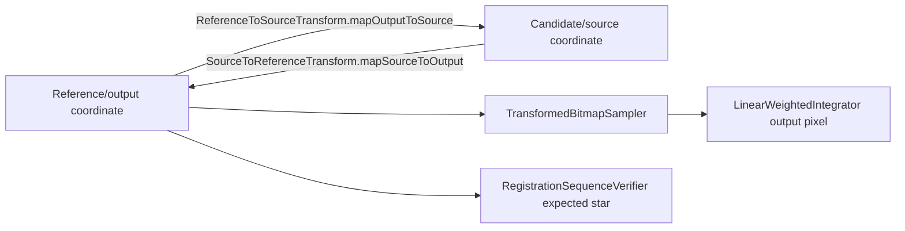

# JPEG transform contract

## Canonical definition

`ReferenceToSourceTransform` maps an output/reference coordinate to the coordinate sampled in a
candidate/source image:

```text
source = center + scale * R(rotation) * (output - center) + (dx, dy)
```

Automatic sequence registration is translation-only, so its exact form is:

```text
sourceX = outputX + dx
sourceY = outputY + dy
candidateStar = referenceStar + (dx, dy)
```

The legacy rotation center is the image origin `(0, 0)`. It is now explicit in the transform
type. An inverse mapping exists only through `inverse().mapSourceToOutput(...)`.



## Numerical example

Reference star: `(100, 100)`; candidate star: `(94, 103)`.

```text
dx = 94 - 100 = -6
dy = 103 - 100 = +3

mapOutputToSource(100, 100) = (94, 103)
inverse().mapSourceToOutput(94, 103) = (100, 100)
```

For a bright point at candidate/source `(1, 5)` and reference/output `(3, 3)`, the canonical
transform is `dx=-2, dy=+2`. Sampling output `(3, 3)` therefore reads source `(1, 5)`.

## Boundary audit

| Component | Input -> output | Direction/sign | Rotation/scale and anchor |
|---|---|---|---|
| `SparseTranslationVotingEstimator` | reference star → candidate star, analysis px | `candidate-reference` | translation only; selected reference is anchor |
| `TranslationHypothesis` / `SequenceRegistrationCandidate` | analysis reference → analysis source | canonical `dx/dy` | no implicit inverse |
| `StellarMotionModelEstimator` | capture index → analysis transform | `velocity * (capture-referenceCapture)` | actual capture number; reference predicts exact identity |
| `SequenceAwareRegistrationEngine` | ordered analyzed frames → registrations | canonical | never uses reference-first list position as capture index |
| `StarSimilarityRegistrar` | reference stars → candidate stars | canonical forward mapping | legacy rigid rotation around origin; automatic path translation-only |
| `scaledToFullResolution` | analysis transform → full transform | signs preserved | `dx*scaleX`, `dy*scaleY`; identity stays zero |
| `ExpectedSequenceMotionModel` | capture index → expected full transform | canonical | reference-relative prediction before scaling |
| `TransformSequenceValidator` | full registration vs full prior | canonical comparison | no inversion or second anchor offset |
| `RegistrationSequenceVerifier` | reference star → candidate evidence | `mapOutputToSource` | sparse aligned stack uses the explicit inverse once, never twice |
| `RegistrationResult` | legacy storage → canonical transform | centralized conversion | origin center retained for compatibility |
| `TransformedBitmapSampler` | output pixel → source sample | canonical forward mapping | bilinear interpolation; out-of-bounds returns no sample |
| `WeightedIntegrationFrame` | source handle + canonical registration | no additional mapping | passes transform unchanged |
| `LinearWeightedIntegrator` | full output tile → full source | delegates to production sampler | no sign change, transpose, or extra scaling |
| `FileBackedArgbPixelSource` | integer source coordinate → ARGB | no geometric mapping | source storage only |
| Preview/debug helpers | selected output file → preview | no registration transform | no warp boundary exists |

## Analysis/full-resolution conversion

Scaling happens once after the anchor-relative analysis transform is selected:

```text
fullDx = analysisDx * fullWidth / analysisWidth
fullDy = analysisDy * fullHeight / analysisHeight
```

X and Y use independent factors. `scaledToAnalysisResolution` is the explicit inverse conversion
used for round-trip tests. Rotated transforms require uniform X/Y scaling; the production
sequence path remains translation-only.

## Verification models

Registration verification compares four explicit interpretations:

1. canonical output-to-source transform;
2. its deliberately reinterpreted inverse;
3. identity;
4. the canonical transform applied twice.

Only the canonical mapping is passed to production integration. Per-frame evidence rejects weak
frames individually; a failed non-reference frame is never replaced with identity.

## Read-only real-session replay

When `AstroPhoto_Session_20260713_123724_20260717_025950.zip` is available, run:

```powershell
$env:ASTROPHOTO_REGISTRATION_REPLAY_ZIP='C:\path\AstroPhoto_Session_20260713_123724_20260717_025950.zip'
.\gradlew.bat testDebugUnitTest --tests com.example.astrophoto.JpegV2Stage8Test.realSessionReplayWhenZipIsProvided
```

The replay extracts into `build/tmp`, leaves the ZIP untouched, and prints the reference capture
index, analysis/full dimensions, scale, velocity, all four verification scores, and per-frame
predicted/selected transform, prediction difference, verification metrics, and acceptance.
